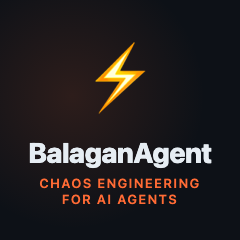
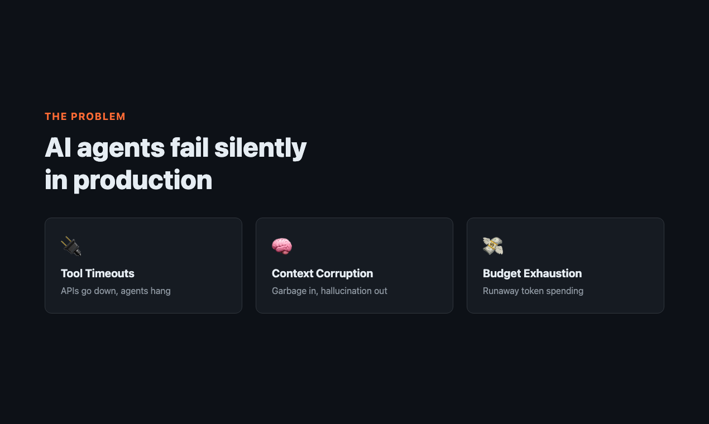
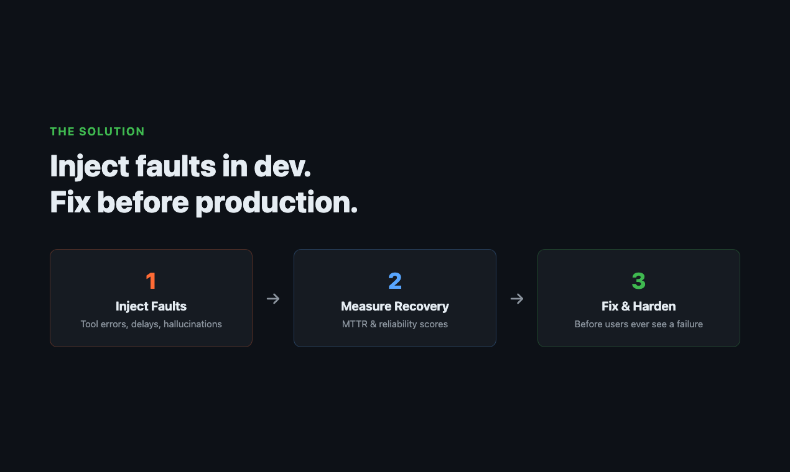
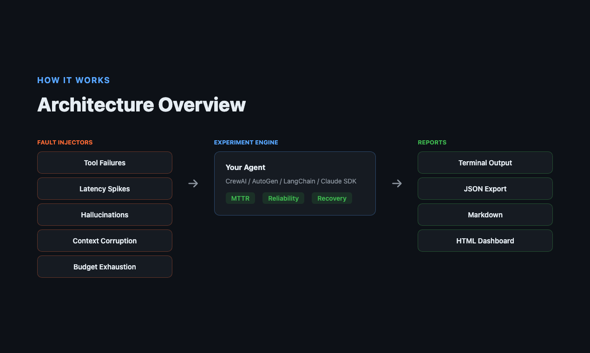
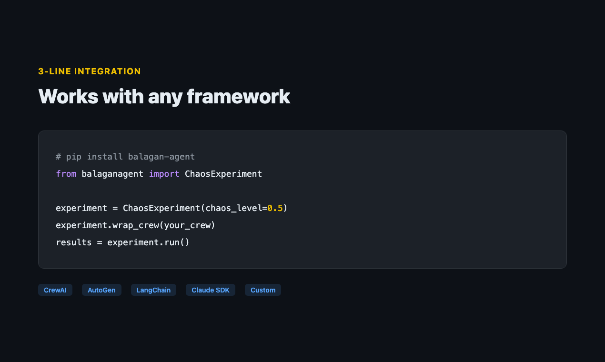
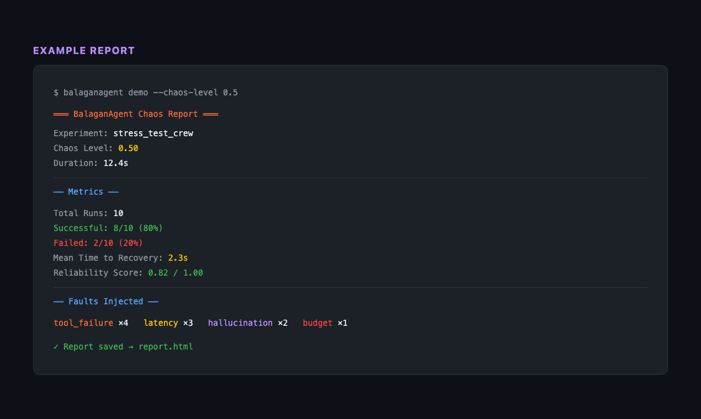
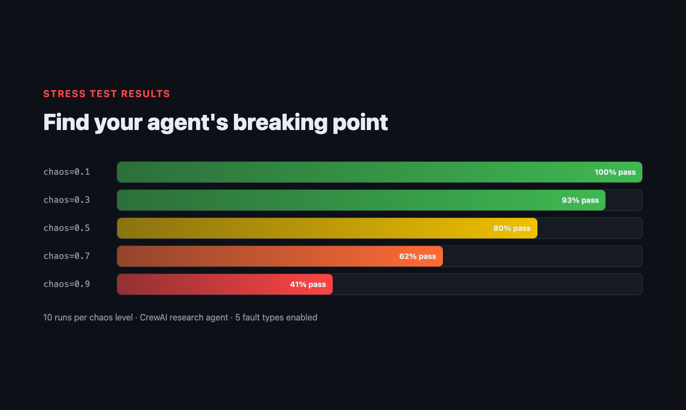

# BalaganAgent

<div style="text-align: center; margin: 2rem 0;">

<h2 style="font-size: 2rem; margin-bottom: 0.5rem;">Chaos Engineering for AI Agents</h2>
<p style="font-size: 1.25rem; color: #666;">Everyone demos agents. Nobody stress-tests them.</p>
</div>

---

**BalaganAgent** is a reliability testing framework that stress-tests AI agents through controlled fault injection — because your agent *will* fail in production, and you should know how it handles it.

<div style="display: flex; gap: 0.5rem; flex-wrap: wrap; margin: 1.5rem 0;">
<a href="https://pypi.org/project/balagan-agent/" style="text-decoration:none;">

</a>
<a href="https://pypi.org/project/balagan-agent/" style="text-decoration:none;">

</a>
<a href="https://github.com/arielshad/balagan-agent/actions" style="text-decoration:none;">

</a>
<a href="https://github.com/arielshad/balagan-agent" style="text-decoration:none;">

</a>
</div>

## Why?

<figure style="margin: 1.5rem 0;">

</figure>

AI agents are entering production, but there's **zero reliability discipline**. Agents fail silently — tool calls time out, return garbage, or hallucinate. Context gets corrupted. Budgets get exhausted. Nobody knows until users complain.

BalaganAgent brings battle-tested chaos engineering principles (Chaos Monkey, Gremlin) to AI agents.

<figure style="margin: 1.5rem 0;">

</figure>

## What you get

- :fontawesome-solid-bolt: **Fault injectors** — tool failures, delays, hallucinations, context corruption, budget exhaustion
- :fontawesome-solid-chart-line: **Metrics** — MTTR (Mean Time To Recovery) + SRE-grade reliability scoring
- :fontawesome-solid-file-lines: **Reports** — terminal / JSON / Markdown / HTML dashboards
- :fontawesome-solid-plug: **Framework wrappers** — CrewAI, AutoGen, LangChain, Claude Agent SDK

## How it works

<figure style="margin: 1.5rem 0;">

</figure>

## Install

```bash
pip install balagan-agent
```

## 60-second quickstart

```python
from balaganagent import ChaosEngine, AgentWrapper

# 1. Wrap your agent
agent = MyAgent()
wrapper = AgentWrapper(agent)
wrapper.configure_chaos(chaos_level=0.5)

# 2. Calls now experience controlled failures
result = wrapper.call_tool("search", "test query")

# 3. Check metrics
metrics = wrapper.get_metrics()
print(f"MTTR: {metrics['mttr']}")
print(f"Reliability: {metrics['reliability_score']}")
```

Or use the CLI:

```bash
balaganagent demo --chaos-level 0.5
```

<figure style="margin: 1.5rem 0;">

</figure>

## Example report output

<figure style="margin: 1.5rem 0;">

</figure>

## Stress test results

<figure style="margin: 1.5rem 0;">

</figure>

## Demo

<video controls style="width: 100%; border-radius: 8px; margin: 1.5rem 0;">
<source src="assets/ph-output/demo-video.mp4" type="video/mp4">
Your browser does not support the video tag.
</video>

## Next steps

- [How It Works](how-it-works.md) — chaos levels, injectors, metrics in depth
- [Integrations](integrations.md) — CrewAI, AutoGen, LangChain, Claude SDK wrappers
- [CLI Reference](cli.md) — `balaganagent run`, `stress`, `demo`, `init`
- [Examples](examples.md) — real-world usage scripts
- [FAQ](faq.md) — common questions

---

<div style="text-align: center; margin-top: 2rem;">

**"Hope is not a strategy. Test your agents."**

[GitHub](https://github.com/arielshad/balagan-agent){ .md-button } [PyPI](https://pypi.org/project/balagan-agent/){ .md-button .md-button--primary }

</div>
